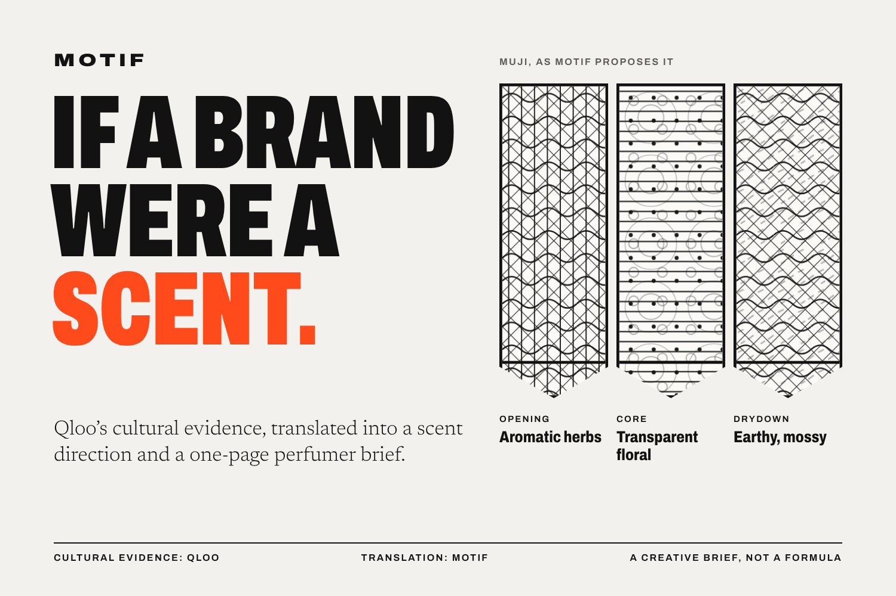
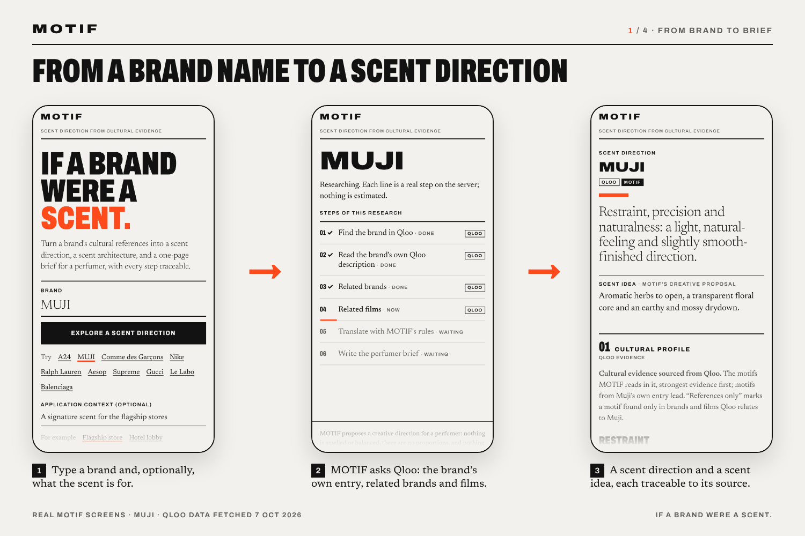
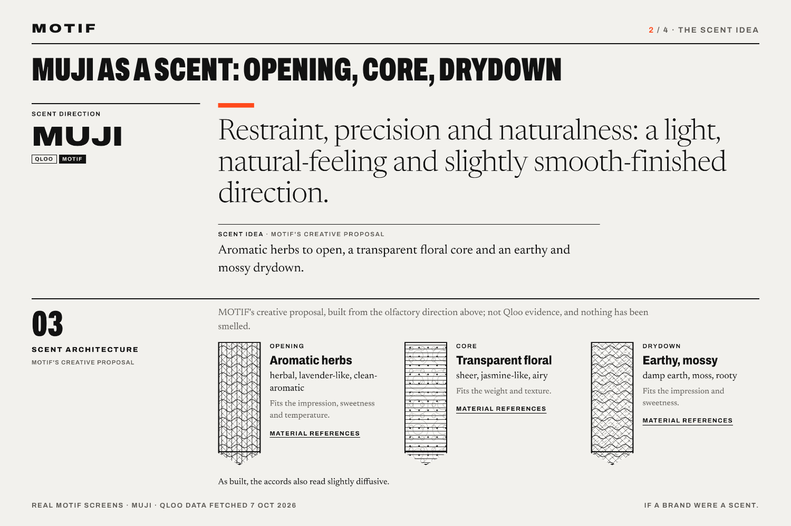
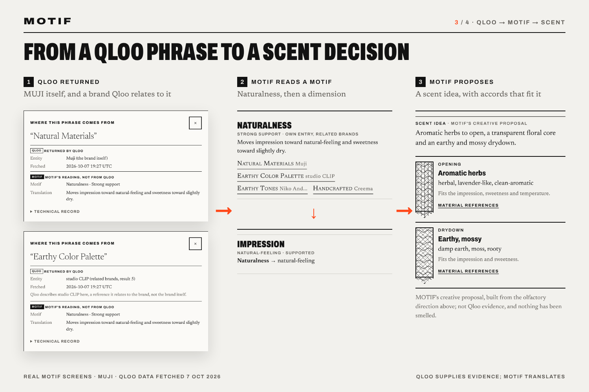
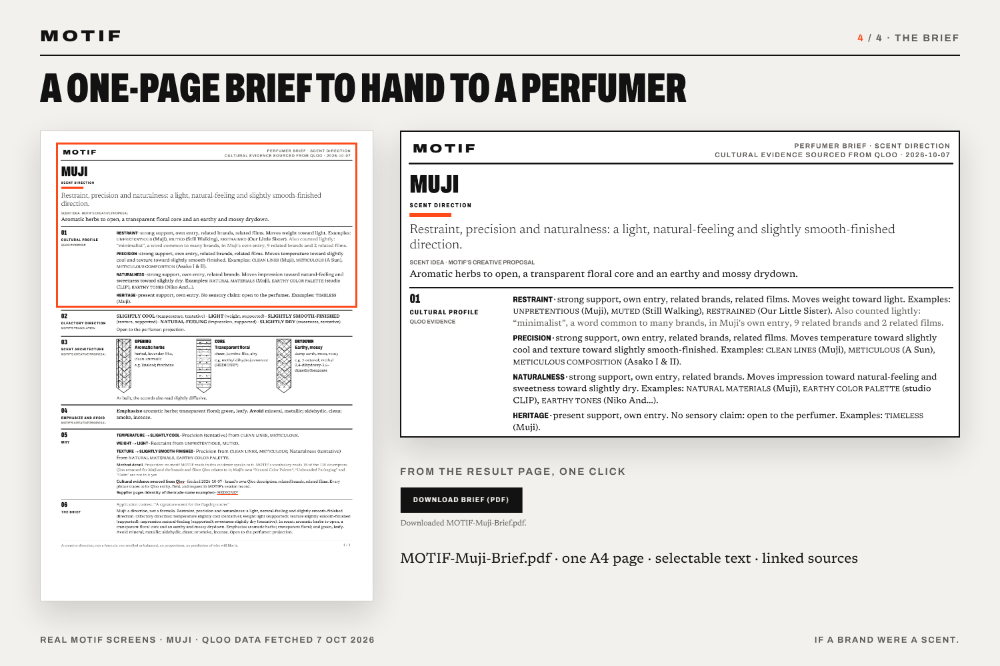

# MOTIF

**If a brand were a scent.** MOTIF reads a brand's cultural evidence in Qloo
and turns it into a traceable scent direction and a one-page brief for a
perfumer.



## Live demo

**<https://motif-pxh8.onrender.com>**

1. Click **MUJI** under the brand field (or type any brand), then **Explore a
   scent direction**. The research steps run for a few seconds.
2. Read the title and the scent idea; click a Qloo phrase such as "Natural
   Materials" to see where it comes from.
3. Scroll to **Why: Qloo → motif → scent** and click **Download brief (PDF)**.
4. Try **Le Labo** (Qloo may ask which entity you mean) or a brand of your own.

Free hosting: the first load after a quiet period can take about a minute.

## What problem it solves

Brand and creative teams developing a scent for a brand's stores, a launch, or a
first fragrance usually start from mood boards and adjectives. The perfumer
receives a brief that says what to make but not why. MOTIF gives both sides a
shared, reasoned starting point: a scent direction, a scent idea built as
opening, core, and drydown, and a one-page brief in which every choice points
back to its source.

## Why Qloo matters

A brand name alone says little about how a scent should feel. Qloo supplies the
cultural context:

- **The brand's own descriptors:** for MUJI, "Unpretentious", "Clean Lines",
  and "Natural Materials".
- **References Qloo relates to the brand,** with their own descriptors: the
  film *Still Walking* ("Muted"), the brand studio CLIP ("Earthy Color Palette").

MOTIF weighs the brand's own words most, adds the references as supporting
weight (labelled as references), and keeps every phrase traceable to its Qloo
entity, request, and fetch date. Where the evidence does not decide a dimension,
MOTIF leaves it open to the perfumer instead of filling it from model memory.
On four brands compared with an LLM working alone, the LLM committed to 19 of 24
dimensions with no traceable source; MOTIF committed to 10, each traceable to
Qloo evidence ([`docs/VALIDATION.md`](docs/VALIDATION.md) §2.5, §3).

## How it works

1. **Research** (4 Qloo requests per brand): search → the brand's own entry →
   related brands → related films. A deterministic controller runs the steps,
   asks the user when a name is ambiguous, and stops cleanly if a request fails.
2. **Motifs:** a versioned lexicon reads the descriptors into 14 cultural
   motifs (restraint, precision, naturalness, opulence, …) with weighted scores;
   the brand's own entry counts most.
3. **Six sensory dimensions:** temperature, weight, texture, impression,
   projection, and sweetness, from a motif-to-sensory model partly built on
   open odor-descriptor data. Each dimension is resolved with a confidence word
   or left open.
4. **Scent architecture:** the best-fitting opening, core, and drydown from a
   library of 23 accord types, with material references (IFRA glossary generic
   names).
5. **Brief:** a headline led by the brand's own motifs, a why-chain from Qloo
   phrase to motif to scent decision, and a one-page PDF. Claude
   (`claude-sonnet-5-5`) writes the prose from the finished result; MOTIF checks
   the text before showing it and uses a labelled template otherwise. Claude
   narrates; MOTIF decides.

## Architecture

```
Qloo /search → /entities → /v2/insights (brands, films)        motif/agent.py, motif/qloo.py
   │  each value copied literally, with request ID and JSON pointer   motif/evidence.py
   ▼
lexicon cues → weighted motif scores (14 motifs)                motif/classify.py, motif/scoring.py
   ▼
six continuous sensory dimensions                               motif/continuous.py
   ▼
scent architecture: opening, core, drydown (23 accord types)    motif/olfactory.py
   ▼
headline, why-chain, brief JSON, prose (template or Claude)     motif/story.py, motif/llm.py
   ▼
web page and one-page PDF                                       motif/web/
```

| Role | Who | Never |
|---|---|---|
| Evidence | **Qloo**: the brand's own entry, the brands and films Qloo relates to it | invented, replaced by fixtures, or called an audience |
| Translation | **MOTIF**: deterministic, versioned rules and models (`config/*.v1.json`) | an LLM step; a formula, dose, or preference prediction |
| Prose | **Claude**: writes the brief text from the finished result | chooses a motif, dimension, accord, or material |

The same evidence and versions always give the same result. The web app is a
Python standard-library server with a vanilla JavaScript front end; keys stay on
the server. The earlier rule engine (`engine-0.3`) is kept frozen as a
measured baseline (`--engine legacy`). Details:
[`docs/ARCHITECTURE.md`](docs/ARCHITECTURE.md),
[`docs/QLOO_ACCESS_NOTES.md`](docs/QLOO_ACCESS_NOTES.md).

## Example output

Real MOTIF output for MUJI, captured on 7 October 2026 from a local run with
live Qloo data (four requests). In this capture the brief's prose came from
MOTIF's template.

| | |
|---|---|
|  |  |
| **Brand to direction.** Type a brand and, optionally, what the scent is for; each research step appears as it runs. | **The scent idea.** Restraint, precision, and naturalness: a light, natural-feeling, slightly smooth-finished direction. Aromatic herbs to open, a transparent floral core, an earthy and mossy drydown. |
|  |  |
| **Qloo phrase to scent decision.** "Natural Materials" (MUJI's own entry) and "Earthy Color Palette" (studio CLIP, a brand Qloo relates to MUJI) both read as naturalness, which shapes the opening and drydown. | **The brief.** One page: direction, scent architecture with material references, what to emphasize and avoid, why, and the Qloo sources. |

Sample PDF: [`docs/examples/MOTIF-Muji-Brief.pdf`](docs/examples/MOTIF-Muji-Brief.pdf).

## Evaluation and evidence

There is no ground truth for "the right scent of a brand", so the checks test
what can be tested: determinism, traceability, differentiation, robustness, and
behaviour on brands the engine was not built on. All checks run offline on
stored Qloo responses.

| Check | Result |
|---|---|
| Determinism | identical output in one process and across interpreters (same SHA-256) |
| Traceability | every contributor of every resolved dimension maps to a Qloo request and JSON pointer (13 of 13 trial brands) |
| Differentiation, 13 trial brands | distinct scent architectures: 3 (frozen rule engine) → 11 (continuous engine) |
| Robustness | leaving one descriptor out changes the architecture in 4% of 523 runs; one related brand or film, 5% of 260 runs |
| Pre-registered holdout, 5 new brands | 4 of 5 resolved, no structural failure; 8% of supporting descriptors misread |
| Negative findings | without the tentative design cells, 7 of the 11 architectures remain; weak profiles converge on one structure |

Reports: [`docs/VALIDATION.md`](docs/VALIDATION.md) (methods and findings),
[`reports/final_validation.md`](reports/final_validation.md),
[`reports/continuous_holdout.md`](reports/continuous_holdout.md),
[`reports/continuous_engine_analysis.md`](reports/continuous_engine_analysis.md),
[`reports/feasibility.md`](reports/feasibility.md) (what Qloo returns, from the
first live runs), [`reports/evidence_excerpt.md`](reports/evidence_excerpt.md)
(literal Qloo values with request IDs and JSON pointers).

## Run locally

Python 3.9+; the engine and server use only the standard library.
`requirements.txt` adds the Anthropic SDK (prose) and fpdf2 (PDF brief).

```sh
git clone https://github.com/burakeliuz/MOTIF && cd MOTIF
pip install -r requirements.txt
python3 -m unittest                  # offline; the tests block all network access

# Live research needs the Qloo hackathon key in the environment: QLOO_API_KEY
python3 -m motif_spike check         # must say READY (never prints the key)
MOTIF_ACCESS_PROTECTION=off python3 -m motif.web    # web app on http://127.0.0.1:8000
python3 -m motif run --reference "MUJI" --type brand  # the same flow from the command line
```

- Prose: set `MOTIF_ANTHROPIC_API_KEY` for Claude; without it, or with
  `MOTIF_LLM_PROVIDER=off`, the labelled template writes the brief.
- The server ships with an optional access gate that is on by default;
  `MOTIF_ACCESS_PROTECTION=off` opens it for local use.
- `--choose <QLOO_ID>` answers an entity question; `--engine legacy` runs the
  frozen baseline; `python3 -m motif compare-engines --reference NAME --recorded
  RUN` compares both on the same stored evidence. Sessions are saved under the
  git-ignored `data/`.
- Exit codes: 0 completed · 3 a question needs an answer · 4 stopped (access
  error, budget, or a missing recording) · 2 usage error.

Deployment and all environment variables: [`docs/DEPLOYMENT.md`](docs/DEPLOYMENT.md).
The original Qloo feasibility playground: [`motif_spike/README.md`](motif_spike/README.md).

## Known limitations

- MOTIF offers a creative starting brief for a perfumer to develop: no formula,
  dosage, or preference prediction, and no perfumer has rated the briefs yet.
- Qloo describes culture, not smell. The culture-to-scent step is MOTIF's
  versioned model: of its 25 motif-to-sensory cells, 5 are medium confidence
  and 20 are low-confidence design readings; leanings that rest only on those
  are labelled tentative.
- Coverage: brands whose descriptors fall outside the lexicon (LEGO, Coca-Cola)
  get thin, similar results.
- Misreads: phrases such as "industrial design" or film-technique words can be
  read as an aesthetic.
- Name resolution: a search can return only stores (IKEA); MOTIF then stops at
  the entity question instead of guessing.
- Small samples: 13 trial brands and 5 holdout brands. The latest lexicon
  (`lexicon-0.4`) was not re-validated on a new holdout.

## Repository map

```
motif/          engine, controller, Qloo access, CLI; motif/web/ server, PDF, static UI
motif_spike/    Qloo feasibility playground (transport and parsers reused by the engine)
config/         versioned lexicon, scoring, sensory model, accord library; frozen legacy rules
tools/          offline analyses: validation, engine comparison, holdout, sensory model review
reports/        validation, analyses, holdouts, feasibility, evidence excerpt, legacy baseline
docs/           architecture, validation, models, Qloo integration, deployment, examples
tests/          unittest suite (network blocked; recorded-data tests skip without data/)
fixtures/       synthetic test fixtures (labelled; never evidence)
```

Model and design documents: [`docs/MOTIF_SCORING.md`](docs/MOTIF_SCORING.md),
[`docs/SENSORY_MODEL_RESEARCH.md`](docs/SENSORY_MODEL_RESEARCH.md),
[`docs/OLFACTORY_LAYER.md`](docs/OLFACTORY_LAYER.md),
[`docs/ENGINE_REDESIGN.md`](docs/ENGINE_REDESIGN.md),
[`docs/EVIDENCE_CONTRACT.md`](docs/EVIDENCE_CONTRACT.md),
[`docs/REFACTOR_LOG.md`](docs/REFACTOR_LOG.md). Earlier design records:
[`MOTIF_QLOO_FEASIBILITY.md`](MOTIF_QLOO_FEASIBILITY.md),
[`MOTIF_BUILD_SPEC.md`](MOTIF_BUILD_SPEC.md).

Brands appear as examples run on Qloo data; none is affiliated with MOTIF.

## License

MIT. See [`LICENSE`](LICENSE).
